# BACON-AI Odoo MCP Server

**Orchestrating Intelligence for the Real World.**

[](https://www.python.org/downloads/)
[](https://opensource.org/licenses/MPL-2.0)
[](https://pypi.org/project/mcp-server-odoo/)
[](#test-coverage)

The most comprehensive MCP server for Odoo ERP. Connect AI assistants like Claude, GPT, and Gemini to your Odoo instance with **17 tools** covering CRUD operations and complete end-to-end business workflows -- from quotation to manufacturing to delivery.

Built and maintained by [BACON-AI](https://bacon-ai.cloud) | Contact: [hello@bacon-ai.cloud](mailto:hello@bacon-ai.cloud)

> **Fork of [ivnvxd/mcp-server-odoo](https://github.com/ivnvxd/mcp-server-odoo)** with workflow tools, bug fixes, and 153 additional tests validated against Odoo 19.0.

---

## Why BACON-AI Odoo MCP?

| Capability | This Server | Typical Alternatives |
|-----------|-------------|---------------------|
| Core CRUD (search, create, update, delete) | 7 tools | 3-5 tools |
| Business Workflow Automation | 10 workflow tools | None |
| End-to-End Process Coverage | Sales, Purchase, Manufacturing, Inventory | CRUD only |
| Database DevOps Pipeline | Shift-left testing with isolated DB branches | None |
| AI-Assisted Data Migration | Import/export with validation and rollback | None |
| YOLO Mode (no module install needed) | Read-only + Full access | Not available |
| Validated Test Suite | 572 tests (153 against live Odoo 19.0) | Minimal or none |
| PyPI Distribution | `pip install mcp-server-odoo` | Manual setup |

---

## Database DevOps Pipeline (Shift-Left Testing)

> **Proven at scale.** This approach is adapted from BACON-AI founder Colin Bacon's shift-left test strategies deployed on large-scale international SAP programs, where separating development and maintenance landscapes prevented production defects across multi-country rollouts. The same discipline -- database isolation, regression gating, and promotion pipelines -- now powers AI-driven ERP testing.

Enterprise ERP changes are high-risk. A broken workflow in production means failed orders, blocked deliveries, and real revenue impact. The BACON-AI Odoo MCP Server brings a **Database DevOps Pipeline** that mirrors git branching -- every feature gets its own isolated database copy, tested independently before promotion through regression gates to production.

### The System Landscape Architecture

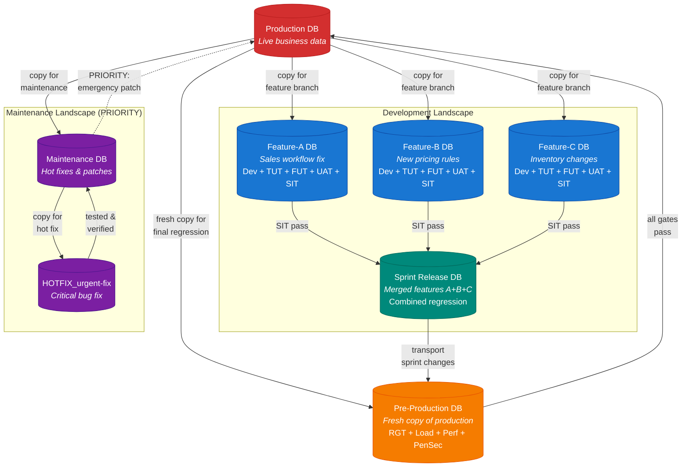

**Maintenance Landscape (PRIORITY)**: Maintenance **always has priority** over development. Bug fixes, security patches, and urgent issues are time-critical -- they are tested on a maintenance copy and transported directly to production via the fast-track path. When a maintenance patch lands in production, the production baseline changes, which triggers a re-baseline cascade for all active development branches (see [Maintenance Priority & Re-Baseline](#maintenance-priority--re-baseline) below).

**Development Landscape**: Each feature gets its own isolated database copy from production. Developers and AI agents run the full development cycle -- coding, TUT, FUT, **early UAT** (shift-left user feedback), and SIT -- without polluting production. Once individual features pass SIT, they are merged into a **Sprint Release DB** for combined regression testing before transport to pre-production.

**Pre-Production**: Always a **fresh copy of production** -- not an accumulation of features. Sprint changes are transported into this clean baseline for final gate testing: RGT (regression), load testing, performance benchmarks, penetration/security testing, and infrastructure sizing validation.

### The Promotion Pipeline

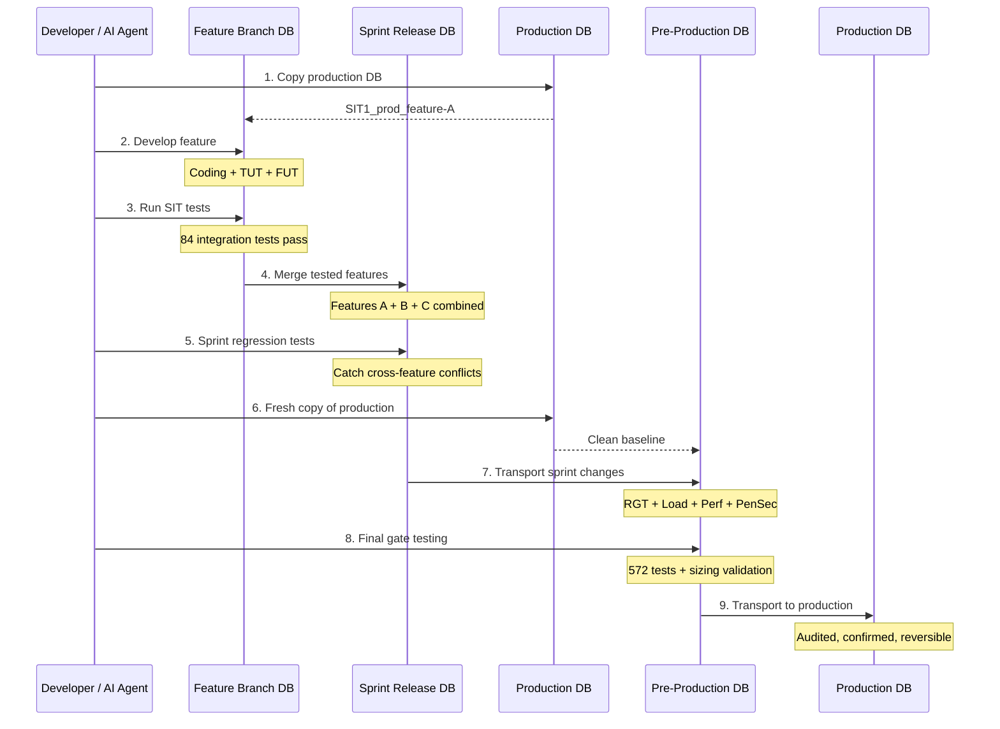

### Why Regression Testing is Critical

When multiple features are developed in parallel, each passing its own SIT tests independently, **cross-feature conflicts only surface when features are merged**. A change to the sales workflow in Feature-A might break the inventory logic that Feature-B depends on. The two-stage regression approach catches this at two levels:

1. **Sprint Regression** -- merged features tested together in a sprint release DB
2. **Pre-Production Regression** -- sprint changes transported into a fresh production copy for final validation with load, performance, and security testing

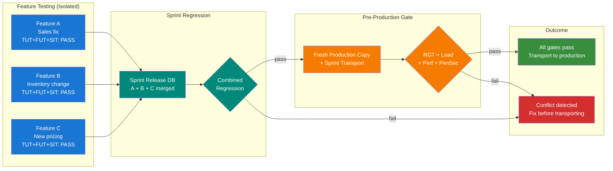

### Development vs Maintenance Landscapes

This separation is essential for enterprise ERP operations:

| Landscape | Priority | Purpose | Testing | Transport Path |
|-----------|----------|---------|---------|----------------|
| **Maintenance** | **HIGHEST** | Hot fixes, security patches, urgent bugs | Targeted + smoke tests | Hotfix -> Maintenance -> Production (fast-track) |
| **Development** | Normal | New features, enhancements, refactoring | TUT + FUT + UAT + SIT per feature | Feature -> Sprint -> Pre-Prod -> Production |
| **Sprint Release** | Normal | Merge & combined regression of features | Combined regression testing | Merged features -> Pre-Prod |
| **Pre-Production** | Normal | Final gate (fresh production copy) | RGT + Load + Perf + PenSec + Sizing | Transport -> Production |

### Maintenance Priority & Re-Baseline

Maintenance **always takes priority** over development. When a critical bug fix is transported to production, the production baseline changes. This creates a version mismatch -- all active development branches are now working against an outdated baseline.

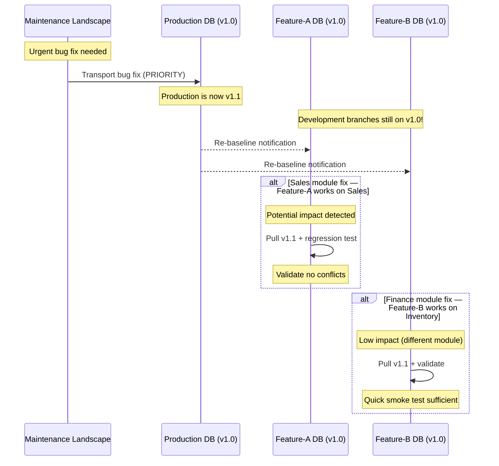

**Impact assessment drives the response.** If the maintenance fix touches the same module a feature team is working on, a full regression test is required. If the fix is in a different module (e.g., finance fix while the team works on sales), a lighter validation is sufficient -- but still needs to be confirmed.

### Transport Conflict Resolution

When both the maintenance landscape and the development landscape are ready to transport to production at the same time, the **transport is blocked** until a code review confirms there are no conflicts:

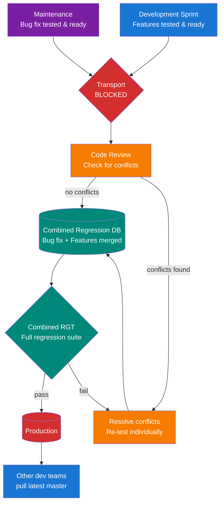

This combined transport approach saves significant time for development teams -- instead of transporting sequentially and re-baselining twice, both tested changes are merged, regression-tested together, and transported in a single controlled deployment. The remaining development teams then pull the latest production version to re-baseline their feature branches.

### Shift-Left UAT: Early User Feedback in Feature Branches

> **Avoiding the "tree swing" problem.** The famous project management analogy -- where every stakeholder interprets the same requirement differently -- shows why late UAT is costly. By the time users see the feature in pre-production, months of development may need reworking.

The shift-left approach moves **User Acceptance Testing (UAT) into the feature branch** as early as possible. Rather than waiting until pre-production to discover that requirements were misunderstood, users validate functional requirements on the isolated feature database while development is still in progress:

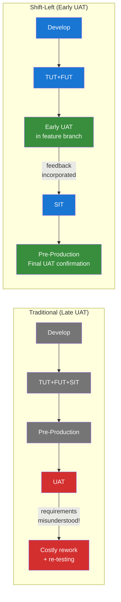

**Early UAT catches requirement misunderstandings before they compound.** A misunderstood requirement caught during feature development costs hours to fix. The same misunderstanding caught in pre-production costs weeks of rework, re-testing across all test levels, and delays to the entire sprint.

All landscapes are AI-driven. The MCP server provides the tools for AI agents to copy databases, execute workflows, run tests, and validate results -- all through natural language.

### Data Migration & Cut-Over

The same pipeline supports system migrations (e.g., legacy ERP to Odoo):

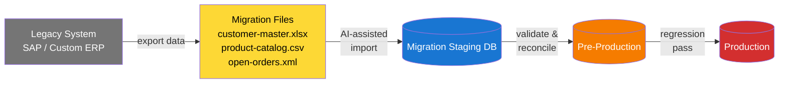

```
User: "Read the customer-master.xlsx and upload those customers
       to the customer master in the staging database"

AI Agent:
  1. Parse 500 rows from Excel
  2. Map columns to Odoo fields
  3. Validate: 495 valid, 5 issues
  4. Dry-run: "Would create 480 new, update 15 existing"
  5. Import with progress tracking
  6. Rollback available for 24 hours
```

---

## End-to-End Business Workflows

Every workflow below has been tested end-to-end against a real Odoo 19.0 instance with 84 system integration tests.

### Order-to-Cash (Sales)

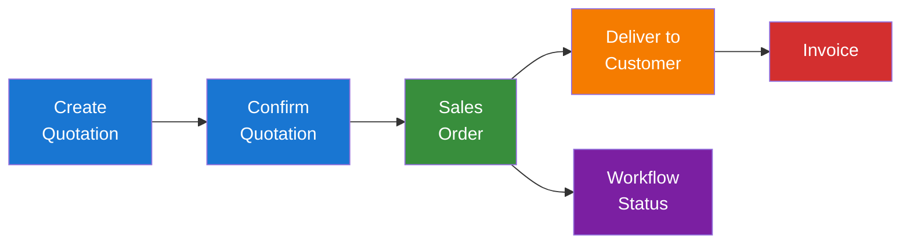

1. **Create Quotation** with customer, product lines, quantities, and pricing
2. **Confirm Quotation** to convert it into a sales order
3. **Deliver to Customer** by validating the outgoing shipment
4. **Track Workflow Status** to see deliveries, invoices, and related documents

### Procure-to-Pay (Purchasing)

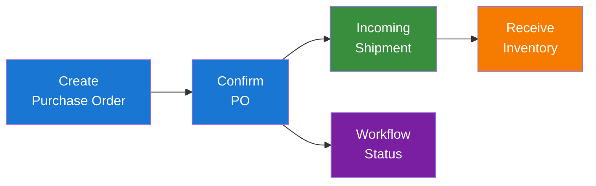

1. **Create Purchase Order** with vendor, product lines, and unit prices
2. **Confirm Purchase Order** to generate incoming shipments
3. **Receive Inventory** by validating the incoming receipt
4. **Track Workflow Status** to see receipts and payment status

### Plan-to-Produce (Manufacturing)

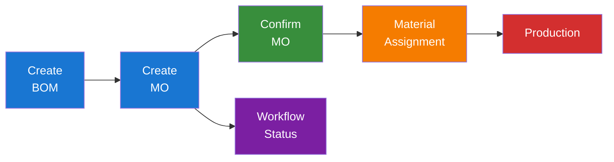

1. **Create Bill of Materials** defining product components and quantities
2. **Create Manufacturing Order** for a specific product and quantity
3. **Confirm Manufacturing Order** to assign materials and begin production
4. **Track Workflow Status** to monitor production progress

### Full Integrated Workflow

All three workflows connect into a complete supply chain:

```python
# 1. Create and confirm a sales quotation
quotation = create_quotation(customer_id=15, product_lines=[...])
order = confirm_quotation(quotation_id=quotation["quotation_id"])

# 2. Create manufacturing order for the sold product
mo = create_manufacturing_order(product_id=373, quantity=2.0, origin=order["order_name"])

# 3. Purchase raw materials from vendor
po = create_purchase_order(vendor_id=42, product_lines=[...])
confirm_purchase_order(po_id=po["po_id"])
receive_inventory(po_name=po["po_name"])

# 4. Confirm manufacturing and produce goods
confirm_manufacturing_order(mo_id=mo["mo_id"])

# 5. Deliver to customer
deliver_to_customer(so_name=order["order_name"])

# 6. Get complete workflow status showing the entire chain
status = get_workflow_status(order_id=order["order_id"], order_type="sale")
```

---

## Available Tools (17 Total)

### Core Operations (7 Tools)

| Tool | Description |
|------|-------------|
| `search_records` | Search any Odoo model with domain filters, field selection, pagination, and ordering |
| `get_record` | Retrieve a specific record by ID with smart field defaults |
| `list_models` | Discover all accessible models with field metadata |
| `create_record` | Create records with field validation and permission checks |
| `update_record` | Update specific fields on existing records |
| `delete_record` | Delete records respecting model-level permissions |
| `read_group` | Aggregate data with grouping and statistical functions |

### Workflow Tools (10 Tools)

| Tool | Description |
|------|-------------|
| `create_quotation` | Create sales quotation with customer, product lines, quantities, pricing |
| `confirm_quotation` | Convert quotation to confirmed sales order (triggers delivery creation) |
| `create_purchase_order` | Create PO with vendor, product lines, and pricing |
| `confirm_purchase_order` | Confirm PO (triggers incoming shipment creation) |
| `receive_inventory` | Validate incoming receipt by PO name or picking ID |
| `deliver_to_customer` | Validate outgoing delivery by SO name or picking ID |
| `create_manufacturing_order` | Create manufacturing order for a product (MRP module) |
| `confirm_manufacturing_order` | Confirm MO and assign materials for production |
| `create_bom` | Create Bill of Materials with component lines |
| `get_workflow_status` | Trace order through complete lifecycle with related documents |

### Database DevOps Tools (Roadmap)

| Tool | Description | Status |
|------|-------------|--------|
| `switch_database` | Dynamic database connection switching | Planned |
| `list_databases` | Discover available databases | Planned |
| `copy_database` | Duplicate database for isolated testing | Planned |
| `drop_database` | Clean up test database copies | Planned |
| `import_data` | AI-assisted data import with validation | Planned |
| `export_data` | Extract data to CSV/JSON/Excel | Planned |

---

## Test Coverage

This server is backed by one of the most thorough test suites of any Odoo MCP implementation. Testing follows the **BACON-AI Agentic-Driven Development & Testing (ADDT)** methodology -- an evolution of TDD where AI agents don't just execute tests, they **learn and improve**. Every test failure feeds back into the agent's knowledge base, refining future test design and execution through a continuous self-annealing cycle.

### V-Model: Development Phases Mapped to Test Levels

The BACON-AI V-Model maps each development phase to a corresponding test level, ensuring every layer of the system is validated at the appropriate scope:

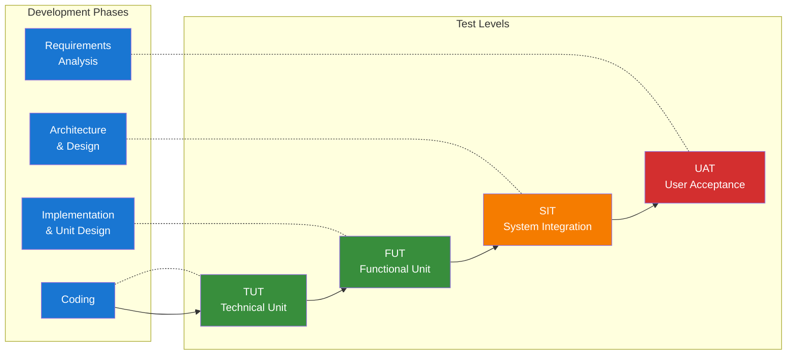

| Level | Full Name | Scope | This Project |
|-------|-----------|-------|-------------|
| **TUT** | Technical Unit Test | Individual functions, mocked dependencies | 69 workflow handler tests + 419 core tests |
| **FUT** | Functional Unit Test | Single features, business logic validation | Workflow tool functional verification |
| **SIT** | System Integration Test | End-to-end with real systems (no mocks) | 84 tests against live Odoo 19.0 |
| **UAT** | User Acceptance Test | Business validation by end users | Full workflow walkthroughs |
| **RGT** | Regression Test | All tests on merged pre-production | Full 572-test suite |

### Self-Annealing: Tests That Improve Themselves

ADDT goes beyond traditional TDD through **self-annealing** -- a continuous improvement cycle where test failures drive knowledge accumulation:

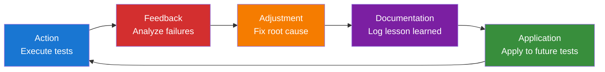

**Example from this project:** SIT tests initially failed against Odoo 19.0 because `action_confirm` on `sale.order` returns different states depending on warehouse configuration. The self-annealing cycle captured this as a lesson learned, and all subsequent test assertions were redesigned to check `success=True` instead of asserting a specific state -- a pattern now applied across all workflow tests.

### Test Pyramid

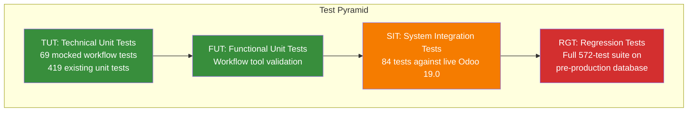

### Test Summary

| Category | Tests | Status | Scope |
|----------|-------|--------|-------|
| Workflow Unit Tests (mocked) | 69 | All passing | All 10 handlers, 4 scenarios each |
| System Integration Tests (live Odoo 19.0) | 84 | All passing | 11 categories, real XML-RPC |
| Existing Unit & Integration Tests | 419 | All passing | Core CRUD, auth, resources |
| **Total** | **572** | **All passing** | |

### System Integration Test Categories (SIT)

All SIT tests run against a **real Odoo 19.0 instance** with actual XML-RPC calls -- no mocks.

| SIT | Category | Tests | What It Validates |
|-----|----------|-------|-------------------|
| SIT-1 | Sales End-to-End | 9 | Quotation creation, confirmation, delivery generation, multi-line orders, date handling |
| SIT-2 | Purchase End-to-End | 6 | PO creation, confirmation, receipt generation, multi-line orders |
| SIT-3 | CRUD Lifecycle | 7 | Create, read, search, update, delete with verification at each step |
| SIT-4 | Data Consistency | 7 | Field-level write/read verification, boolean/numeric fields, empty value handling |
| SIT-5 | Error Handling | 17 | Invalid models, nonexistent records, state violations, missing parameters, duplicate operations |
| SIT-6 | Model Discovery | 8 | Model listing, metadata structure, resource templates, YOLO mode indicators |
| SIT-7 | Workflow Status | 5 | Status tracking structure, delivery references, order name formats |
| SIT-8 | Connection & Auth | 7 | Authentication flow, server version, health check, reconnection, context manager |
| SIT-9 | Direct Connection Ops | 10 | Low-level search, read, write, unlink, fields_get, search_read, execute, ordering |
| SIT-10 | Manufacturing | 2 | MO creation and workflow status (conditional on MRP module) |
| SIT-11 | Search Features | 6 | String domains, pagination, ordering, smart defaults, empty results |

### Regression Testing Strategy

Testing follows a **two-stage regression approach** that mirrors the database promotion pipeline:

| Gate | Database | Tests Run | What It Catches |
|------|----------|-----------|-----------------|
| **Feature TUT+FUT+SIT** | Feature branch DB | 84 integration tests + unit tests | Feature-specific bugs against real data |
| **Sprint Regression** | Sprint release DB (merged features) | All 572 tests | Cross-feature conflicts, side effects |
| **Pre-Production RGT** | Fresh production copy + sprint transport | 572 tests + load + perf + PenSec | Regression, performance, security, sizing |
| **Production Smoke** | Production | Critical path subset | Post-deployment verification |

---

## Quick Start

### Installation

```bash
pip install mcp-server-odoo
```

### Configuration

Add to your MCP client settings (Claude Desktop, Claude Code, Cursor, VS Code, etc.):

```json
{
  "mcpServers": {
    "odoo": {
      "command": "uvx",
      "args": ["mcp-server-odoo"],
      "env": {
        "ODOO_URL": "https://your-odoo-instance.com",
        "ODOO_API_KEY": "your-api-key-here",
        "ODOO_DB": "your-database-name"
      }
    }
  }
}
```

### YOLO Mode (No Module Install Needed)

Connect to **any standard Odoo instance** without installing additional modules:

```json
{
  "mcpServers": {
    "odoo": {
      "command": "uvx",
      "args": ["mcp-server-odoo"],
      "env": {
        "ODOO_URL": "http://localhost:8069",
        "ODOO_USER": "admin",
        "ODOO_PASSWORD": "admin",
        "ODOO_DB": "mydb",
        "ODOO_YOLO": "true"
      }
    }
  }
}
```

| Mode | Env Value | Description |
|------|-----------|-------------|
| Off (default) | `off` | Requires MCP module installed on Odoo |
| Read-Only | `read` | All read operations, no writes. Safe for demos. |
| Full Access | `true` | Full CRUD + workflows. Dev/test environments only. |

### Environment Variables

| Variable | Required | Description |
|----------|----------|-------------|
| `ODOO_URL` | Yes | Your Odoo instance URL |
| `ODOO_API_KEY` | Yes* | API key authentication (recommended) |
| `ODOO_USER` | Yes* | Username (if not using API key) |
| `ODOO_PASSWORD` | Yes* | Password (if not using API key) |
| `ODOO_DB` | No | Database name (auto-detected if not set) |
| `ODOO_YOLO` | No | YOLO mode: `off`, `read`, or `true` |

*Either `ODOO_API_KEY` or both `ODOO_USER` and `ODOO_PASSWORD` are required.

### Transport Options

| Transport | Use Case | Command |
|-----------|----------|---------|
| **stdio** (default) | Desktop AI apps (Claude Desktop, Cursor) | `uvx mcp-server-odoo` |
| **streamable-http** | Remote access, web clients | `uvx mcp-server-odoo --transport streamable-http --port 8000` |

---

## Usage Examples

Once connected, ask your AI assistant naturally:

**Search & Retrieve:**
- "Show me all customers from Germany"
- "Find products with stock below 10 units"
- "List today's sales orders over 1000 EUR"

**Create & Manage:**
- "Create a quotation for Acme Corp with 5 units of Widget Pro at 99.99 each"
- "Confirm quotation S00286 and check if a delivery was created"
- "Create a purchase order to restock 100 units of raw material from our supplier"

**Complete Workflows:**
- "Walk me through creating a full sales order, from quotation to delivery"
- "Set up a manufacturing order for 50 units of our flagship product"
- "Check the workflow status of order S00280 -- where are we in the process?"

**Database DevOps (Roadmap):**
- "Copy production to a test database for the new pricing feature"
- "Run integration tests on the feature database"
- "Import customer-master.xlsx into the staging database"

---

## Resources

Direct access to Odoo data through MCP resource URIs:

```
odoo://res.partner/record/1           - Get partner by ID
odoo://product.product/search?domain=[["qty_available",">",0]]  - Search products
odoo://sale.order/browse?ids=1,2,3    - Browse multiple records
odoo://res.partner/count?domain=[["customer_rank",">",0]]       - Count records
odoo://product.product/fields         - Field metadata
```

---

## About BACON-AI

**BACON-AI** develops self-learning AI frameworks that automate complex workflows across DevOps, robotics, and enterprise systems with deterministic control.

### What We Do

- **AI Business Consulting** -- Helping organizations harness AI to streamline operations, from strategy to implementation
- **Enterprise ERP Integration** -- Deep expertise in SAP and Odoo, connecting AI agents to real business processes
- **Agentic-Driven Development & Testing (ADDT)** -- Our evolution of TDD where AI agents don't just execute -- they **learn and improve**. Through self-annealing cycles (Action -> Feedback -> Adjustment -> Documentation -> Application), every test run makes the next one smarter. This MCP server and its 572 tests are built and continuously refined using ADDT.
- **AI Orchestration** -- Coordinating complex multi-agent systems with deterministic control using our BACON-AI 12-phase framework
- **Shift-Left Test Strategy** -- Proven on large-scale international SAP programs. The Database DevOps Pipeline in this project applies the same landscape separation (development vs maintenance) and regression gating that prevented production defects across multi-country ERP rollouts. Our V-Model maps development phases to test levels (TUT/FUT/SIT/UAT/RGT) ensuring complete coverage from unit to acceptance.
- **Robotics Integration** -- Smart AI frameworks for hardware and sensor control

### Our Expertise

With a foundation in **SAP test architecture** and large-scale international ERP programs, BACON-AI founder Colin Bacon brings production-grade reliability to AI automation. The shift-left testing strategies, landscape management, regression gating, maintenance priority protocols, and transport conflict resolution in this project are proven patterns from real enterprise deployments -- now enhanced with AI-driven test execution.

We don't just build demos -- we build systems that work in the real world.

> **Coming Soon:** *"Agentic-Driven Testing: The Shift-Left Revolution for SAP Projects"* by Colin Bacon -- a comprehensive guide to the landscape architectures, V-Model test strategies, maintenance priority protocols, and AI-driven quality gates described in this project. From traditional SAP test management to agentic self-annealing test frameworks, this book details how to revolutionise SAP project delivery with AI.

### Get in Touch

- **Website:** [bacon-ai.cloud](https://bacon-ai.cloud)
- **Email:** [hello@bacon-ai.cloud](mailto:hello@bacon-ai.cloud)
- **Book & Speaking Enquiries:** [hello@bacon-ai.cloud](mailto:hello@bacon-ai.cloud)
- **Live Demos & Workshops:** Available on request

---

## Contributing

Contributions are welcome! This is a fork of [ivnvxd/mcp-server-odoo](https://github.com/ivnvxd/mcp-server-odoo) with extended workflow tools and comprehensive testing.

```bash
# Clone and install
git clone https://github.com/BACON-AI-CLOUD/bacon-ai-odoo-mcp.git
cd bacon-ai-odoo-mcp
pip install -e ".[dev]"

# Run tests
pytest --cov
```

See the full [Roadmap](docs/ROADMAP.md) for planned features.

## License

This project is licensed under the Mozilla Public License 2.0 (MPL-2.0) - see the [LICENSE](LICENSE) file for details.

---

*Built with the [BACON-AI Framework](https://bacon-ai.cloud) -- Orchestrating Intelligence for the Real World.*
